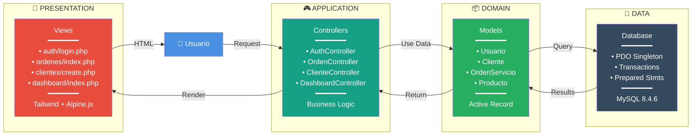
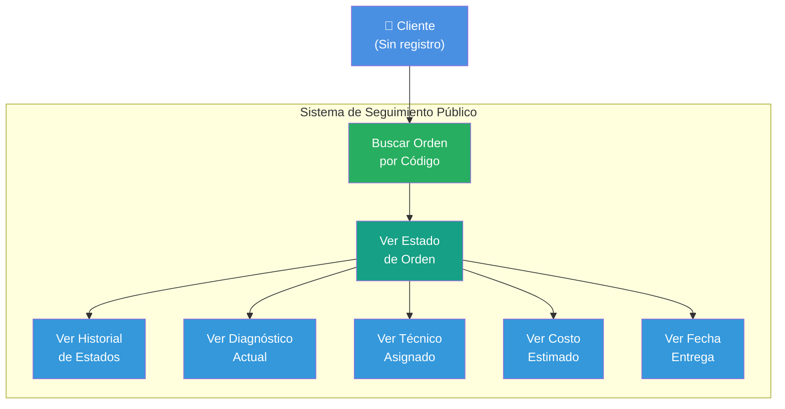
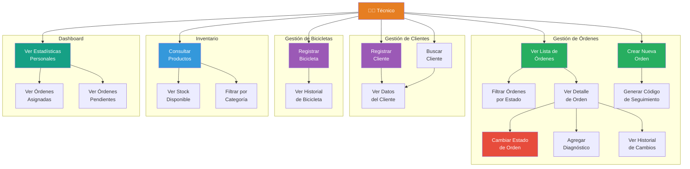
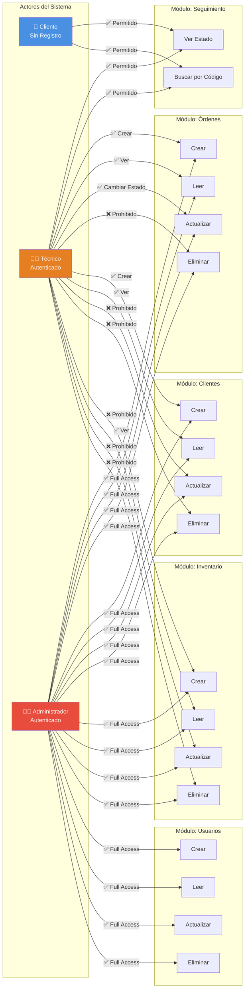

## Arquitectura en Capas (MVC)

## Diagramas de Casos de Uso por Actor

### Caso de Uso: Cliente (Público - Sin Registro)

### Caso de Uso: Técnico

### Caso de Uso: Administrador

```mermaid
graph TB
    Admin["👨‍💼 Administrador"]
    
    subgraph "Gestión de Órdenes (Completo)"
        UC1["Crear<br/>Orden"]
        UC2["Ver Todas<br/>las Órdenes"]
        UC3["Editar<br/>Orden"]
        UC4["Cancelar<br/>Orden"]
        UC5["Cambiar<br/>Estado"]
        UC6["Asignar<br/>Técnico"]
        UC7["Ver Reportes<br/>de Órdenes"]
        UC8["Filtrar por<br/>Fecha/Estado"]
    end
    
    subgraph "Gestión de Clientes (CRUD)"
        UC9["Crear<br/>Cliente"]
        UC10["Listar<br/>Clientes"]
        UC11["Editar<br/>Cliente"]
        UC12["Desactivar<br/>Cliente"]
        UC13["Ver Historial<br/>de Cliente"]
        UC14["Buscar<br/>Cliente"]
    end
    
    subgraph "Gestión de Inventario (CRUD)"
        UC15["Agregar<br/>Producto"]
        UC16["Listar<br/>Productos"]
        UC17["Editar<br/>Producto"]
        UC18["Eliminar<br/>Producto"]
        UC19["Actualizar<br/>Stock"]
        UC20["Ver Stock<br/>Bajo"]
        UC21["Ver Productos<br/>por Categoría"]
    end
    
    subgraph "Gestión de Usuarios"
        UC22["Crear<br/>Usuario"]
        UC23["Listar<br/>Usuarios"]
        UC24["Editar<br/>Usuario"]
        UC25["Desactivar<br/>Usuario"]
        UC26["Asignar<br/>Roles"]
        UC27["Ver Actividad<br/>de Usuarios"]
    end
    
    subgraph "Dashboard Administrativo"
        UC28["Ver Estadísticas<br/>Globales"]
        UC29["Ver Gráficos<br/>de Ventas"]
        UC30["Ver Órdenes<br/>Pendientes"]
        UC31["Ver Alertas<br/>Stock Bajo"]
        UC32["Exportar<br/>Reportes"]
    end
    
    subgraph "Configuración del Sistema"
        UC33["Configurar<br/>Parámetros"]
        UC34["Ver Logs<br/>del Sistema"]
        UC35["Gestionar<br/>Respaldos"]
    end
    
    Admin --> UC1
    Admin --> UC2
    Admin --> UC9
    Admin --> UC10
    Admin --> UC15
    Admin --> UC16
    Admin --> UC22
    Admin --> UC23
    Admin --> UC28
    Admin --> UC33
    
    UC2 --> UC3
    UC2 --> UC4
    UC2 --> UC5
    UC2 --> UC6
    UC2 --> UC7
    UC2 --> UC8
    
    UC10 --> UC11
    UC10 --> UC12
    UC10 --> UC13
    UC10 --> UC14
    
    UC16 --> UC17
    UC16 --> UC18
    UC16 --> UC19
    UC16 --> UC20
    UC16 --> UC21
    
    UC23 --> UC24
    UC23 --> UC25
    UC23 --> UC26
    UC23 --> UC27
    
    UC28 --> UC29
    UC28 --> UC30
    UC28 --> UC31
    UC28 --> UC32
    
    UC33 --> UC34
    UC33 --> UC35
    
    style Admin fill:#E74C3C,color:#fff
    style UC1 fill:#27AE60,color:#fff
    style UC2 fill:#27AE60,color:#fff
    style UC4 fill:#E74C3C,color:#fff
    style UC9 fill:#9B59B6,color:#fff
    style UC10 fill:#9B59B6,color:#fff
    style UC15 fill:#3498DB,color:#fff
    style UC16 fill:#3498DB,color:#fff
    style UC22 fill:#F39C12,color:#fff
    style UC23 fill:#F39C12,color:#fff
    style UC28 fill:#16A085,color:#fff
    style UC33 fill:#34495E,color:#fff
```

### Comparativa de Permisos por Actor

