## Arquitectura en Capas (MVC)

```mermaid
graph LR
    subgraph "📱 PRESENTATION"
        V["Views<br/>━━━━━━━<br/>• auth/login.php<br/>• ordenes/index.php<br/>• clientes/create.php<br/>• dashboard/index.php<br/>━━━━━━━<br/>Tailwind + Alpine.js"]
    end
    
    subgraph "🎮 APPLICATION"
        C["Controllers<br/>━━━━━━━<br/>• AuthController<br/>• OrdenController<br/>• ClienteController<br/>• DashboardController<br/>━━━━━━━<br/>Business Logic"]
    end
    
    subgraph "📦 DOMAIN"
        M["Models<br/>━━━━━━━<br/>• Usuario<br/>• Cliente<br/>• OrdenServicio<br/>• Producto<br/>━━━━━━━<br/>Active Record"]
    end
    
    subgraph "💾 DATA"
        D["Database<br/>━━━━━━━<br/>• PDO Singleton<br/>• Transactions<br/>• Prepared Stmts<br/>━━━━━━━<br/>MySQL 8.4.6"]
    end

    User["👤 Usuario"] -->|Request| C
    C -->|Use Data| M
    M -->|Query| D
    D -->|Results| M
    M -->|Return| C
    C -->|Render| V
    V -->|HTML| User

    style User fill:#4A90E2,color:#fff
    style V fill:#E74C3C,color:#fff
    style C fill:#16A085,color:#fff
    style M fill:#27AE60,color:#fff
    style D fill:#34495E,color:#fff
```

## Diagramas de Casos de Uso por Actor

### Caso de Uso: Cliente (Público - Sin Registro)

```mermaid
graph TB
    Cliente["👤 Cliente<br/>(Sin registro)"]
    
    subgraph "Sistema de Seguimiento Público"
        UC1["Buscar Orden<br/>por Código"]
        UC2["Ver Estado<br/>de Orden"]
        UC3["Ver Historial<br/>de Estados"]
        UC4["Ver Diagnóstico<br/>Actual"]
        UC5["Ver Técnico<br/>Asignado"]
        UC6["Ver Costo<br/>Estimado"]
        UC7["Ver Fecha<br/>Entrega"]
    end
    
    Cliente --> UC1
    UC1 --> UC2
    UC2 --> UC3
    UC2 --> UC4
    UC2 --> UC5
    UC2 --> UC6
    UC2 --> UC7
    
    style Cliente fill:#4A90E2,color:#fff
    style UC1 fill:#27AE60,color:#fff
    style UC2 fill:#16A085,color:#fff
    style UC3 fill:#3498DB,color:#fff
    style UC4 fill:#3498DB,color:#fff
    style UC5 fill:#3498DB,color:#fff
    style UC6 fill:#3498DB,color:#fff
    style UC7 fill:#3498DB,color:#fff
```

### Caso de Uso: Técnico

```mermaid
graph TB
    Tecnico["👨‍🔧 Técnico"]
    
    subgraph "Gestión de Órdenes"
        UC1["Crear Nueva<br/>Orden"]
        UC2["Ver Lista de<br/>Órdenes"]
        UC3["Filtrar Órdenes<br/>por Estado"]
        UC4["Ver Detalle<br/>de Orden"]
        UC5["Cambiar Estado<br/>de Orden"]
        UC6["Agregar<br/>Diagnóstico"]
        UC7["Ver Historial<br/>de Cambios"]
        UC8["Generar Código<br/>de Seguimiento"]
    end
    
    subgraph "Gestión de Clientes"
        UC9["Registrar<br/>Cliente"]
        UC10["Buscar<br/>Cliente"]
        UC11["Ver Datos<br/>del Cliente"]
    end
    
    subgraph "Gestión de Bicicletas"
        UC12["Registrar<br/>Bicicleta"]
        UC13["Ver Historial<br/>de Bicicleta"]
    end
    
    subgraph "Inventario"
        UC14["Consultar<br/>Productos"]
        UC15["Ver Stock<br/>Disponible"]
        UC16["Filtrar por<br/>Categoría"]
    end
    
    subgraph "Dashboard"
        UC17["Ver Estadísticas<br/>Personales"]
        UC18["Ver Órdenes<br/>Asignadas"]
        UC19["Ver Órdenes<br/>Pendientes"]
    end
    
    Tecnico --> UC1
    Tecnico --> UC2
    Tecnico --> UC9
    Tecnico --> UC10
    Tecnico --> UC12
    Tecnico --> UC14
    Tecnico --> UC17
    
    UC1 --> UC8
    UC2 --> UC3
    UC2 --> UC4
    UC4 --> UC5
    UC4 --> UC6
    UC4 --> UC7
    UC9 --> UC11
    UC10 --> UC11
    UC12 --> UC13
    UC14 --> UC15
    UC14 --> UC16
    UC17 --> UC18
    UC17 --> UC19
    
    style Tecnico fill:#E67E22,color:#fff
    style UC1 fill:#27AE60,color:#fff
    style UC2 fill:#27AE60,color:#fff
    style UC5 fill:#E74C3C,color:#fff
    style UC9 fill:#9B59B6,color:#fff
    style UC12 fill:#9B59B6,color:#fff
    style UC14 fill:#3498DB,color:#fff
    style UC17 fill:#16A085,color:#fff
```

### Caso de Uso: Administrador

```mermaid
graph TB
    Admin["👨‍💼 Administrador"]
    
    subgraph "Gestión de Órdenes (Completo)"
        UC1["Crear<br/>Orden"]
        UC2["Ver Todas<br/>las Órdenes"]
        UC3["Editar<br/>Orden"]
        UC4["Cancelar<br/>Orden"]
        UC5["Cambiar<br/>Estado"]
        UC6["Asignar<br/>Técnico"]
        UC7["Ver Reportes<br/>de Órdenes"]
        UC8["Filtrar por<br/>Fecha/Estado"]
    end
    
    subgraph "Gestión de Clientes (CRUD)"
        UC9["Crear<br/>Cliente"]
        UC10["Listar<br/>Clientes"]
        UC11["Editar<br/>Cliente"]
        UC12["Desactivar<br/>Cliente"]
        UC13["Ver Historial<br/>de Cliente"]
        UC14["Buscar<br/>Cliente"]
    end
    
    subgraph "Gestión de Inventario (CRUD)"
        UC15["Agregar<br/>Producto"]
        UC16["Listar<br/>Productos"]
        UC17["Editar<br/>Producto"]
        UC18["Eliminar<br/>Producto"]
        UC19["Actualizar<br/>Stock"]
        UC20["Ver Stock<br/>Bajo"]
        UC21["Ver Productos<br/>por Categoría"]
    end
    
    subgraph "Gestión de Usuarios"
        UC22["Crear<br/>Usuario"]
        UC23["Listar<br/>Usuarios"]
        UC24["Editar<br/>Usuario"]
        UC25["Desactivar<br/>Usuario"]
        UC26["Asignar<br/>Roles"]
        UC27["Ver Actividad<br/>de Usuarios"]
    end
    
    subgraph "Dashboard Administrativo"
        UC28["Ver Estadísticas<br/>Globales"]
        UC29["Ver Gráficos<br/>de Ventas"]
        UC30["Ver Órdenes<br/>Pendientes"]
        UC31["Ver Alertas<br/>Stock Bajo"]
        UC32["Exportar<br/>Reportes"]
    end
    
    subgraph "Configuración del Sistema"
        UC33["Configurar<br/>Parámetros"]
        UC34["Ver Logs<br/>del Sistema"]
        UC35["Gestionar<br/>Respaldos"]
    end
    
    Admin --> UC1
    Admin --> UC2
    Admin --> UC9
    Admin --> UC10
    Admin --> UC15
    Admin --> UC16
    Admin --> UC22
    Admin --> UC23
    Admin --> UC28
    Admin --> UC33
    
    UC2 --> UC3
    UC2 --> UC4
    UC2 --> UC5
    UC2 --> UC6
    UC2 --> UC7
    UC2 --> UC8
    
    UC10 --> UC11
    UC10 --> UC12
    UC10 --> UC13
    UC10 --> UC14
    
    UC16 --> UC17
    UC16 --> UC18
    UC16 --> UC19
    UC16 --> UC20
    UC16 --> UC21
    
    UC23 --> UC24
    UC23 --> UC25
    UC23 --> UC26
    UC23 --> UC27
    
    UC28 --> UC29
    UC28 --> UC30
    UC28 --> UC31
    UC28 --> UC32
    
    UC33 --> UC34
    UC33 --> UC35
    
    style Admin fill:#E74C3C,color:#fff
    style UC1 fill:#27AE60,color:#fff
    style UC2 fill:#27AE60,color:#fff
    style UC4 fill:#E74C3C,color:#fff
    style UC9 fill:#9B59B6,color:#fff
    style UC10 fill:#9B59B6,color:#fff
    style UC15 fill:#3498DB,color:#fff
    style UC16 fill:#3498DB,color:#fff
    style UC22 fill:#F39C12,color:#fff
    style UC23 fill:#F39C12,color:#fff
    style UC28 fill:#16A085,color:#fff
    style UC33 fill:#34495E,color:#fff
```

### Comparativa de Permisos por Actor

```mermaid
graph LR
    subgraph "Actores del Sistema"
        Cliente["👤 Cliente<br/>Sin Registro"]
        Tecnico["👨‍🔧 Técnico<br/>Autenticado"]
        Admin["👨‍💼 Administrador<br/>Autenticado"]
    end
    
    subgraph "Módulo: Seguimiento"
        S1["Ver Estado"]
        S2["Buscar por Código"]
    end
    
    subgraph "Módulo: Órdenes"
        O1["Crear"]
        O2["Leer"]
        O3["Actualizar"]
        O4["Eliminar"]
    end
    
    subgraph "Módulo: Clientes"
        C1["Crear"]
        C2["Leer"]
        C3["Actualizar"]
        C4["Eliminar"]
    end
    
    subgraph "Módulo: Inventario"
        I1["Crear"]
        I2["Leer"]
        I3["Actualizar"]
        I4["Eliminar"]
    end
    
    subgraph "Módulo: Usuarios"
        U1["Crear"]
        U2["Leer"]
        U3["Actualizar"]
        U4["Eliminar"]
    end
    
    Cliente -->|✅ Permitido| S1
    Cliente -->|✅ Permitido| S2
    
    Tecnico -->|✅ Permitido| S1
    Tecnico -->|✅ Permitido| S2
    Tecnico -->|✅ Crear| O1
    Tecnico -->|✅ Ver| O2
    Tecnico -->|✅ Cambiar Estado| O3
    Tecnico -->|❌ Prohibido| O4
    Tecnico -->|✅ Crear| C1
    Tecnico -->|✅ Ver| C2
    Tecnico -->|❌ Prohibido| C3
    Tecnico -->|❌ Prohibido| C4
    Tecnico -->|❌ Prohibido| I1
    Tecnico -->|✅ Ver| I2
    Tecnico -->|❌ Prohibido| I3
    Tecnico -->|❌ Prohibido| I4
    
    Admin -->|✅ Full Access| O1
    Admin -->|✅ Full Access| O2
    Admin -->|✅ Full Access| O3
    Admin -->|✅ Full Access| O4
    Admin -->|✅ Full Access| C1
    Admin -->|✅ Full Access| C2
    Admin -->|✅ Full Access| C3
    Admin -->|✅ Full Access| C4
    Admin -->|✅ Full Access| I1
    Admin -->|✅ Full Access| I2
    Admin -->|✅ Full Access| I3
    Admin -->|✅ Full Access| I4
    Admin -->|✅ Full Access| U1
    Admin -->|✅ Full Access| U2
    Admin -->|✅ Full Access| U3
    Admin -->|✅ Full Access| U4
    
    style Cliente fill:#4A90E2,color:#fff
    style Tecnico fill:#E67E22,color:#fff
    style Admin fill:#E74C3C,color:#fff
```

